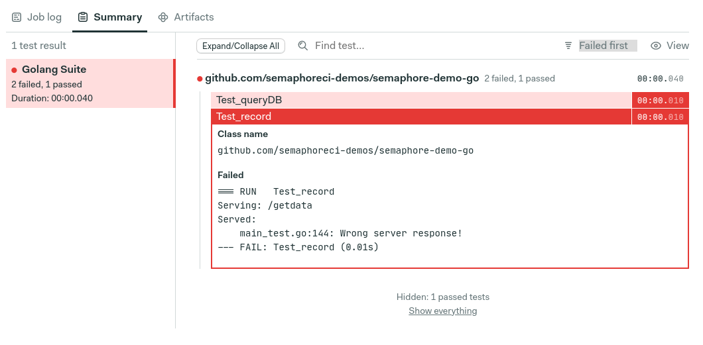

# Go

This guide covers configuring Golang projects on Semaphore.
If you’re new to Semaphore we recommend reading the
[Guided tour](https://docs.semaphoreci.com/guided-tour/getting-started/) first.

## Hello world

```yaml
# .semaphore/semaphore.yml
version: v1.0
name: Go example
agent:
  machine:
    type: e1-standard-2
    os_image: ubuntu1804
blocks:
  - name: Hello world
    task:
      jobs:
        - name: Run Go
          commands:
            - go version
```

## Example project

Semaphore provides a tutorial and example Go application with a working
CI pipeline that you can use to get started quickly:

- [Golang Continuous Integration tutorial][go-tutorial]
- [Demo project on GitHub][go-demo-project]

## Supported Go versions

Semaphore supports all versions of Go. You have the following options:

- Linux: Go is available out-of-the-box in the [Ubuntu 18.04 VM image][ubuntu-go].
- Docker: use [semaphoreci/golang](/ci-cd-environment/semaphore-registry-images/#golang) or
  [your own Docker image][docker-env] with the version of Go and other
  packages that you want.

Follow the links above for details on available language versions and
additional tools.

### Selecting a Go version on Linux

The [Linux VM][ubuntu1804] provides multiple versions of Go.
You can switch between them using the [`sem-version` tool][sem-version].

For example, enter the following in your `semaphore.yml` file:

``` yaml
blocks:
  - name: Tests
    task:
      prologue:
        commands:
          - sem-version go 1.12
      jobs:
        - name: Tests
          commands:
            - go version
```

If the version of Go that you need is not available in the Linux VM,
we recommend running your jobs in [a custom Docker image][docker-env].

## Test summary

!!! beta "Feature in beta"
    Beta features are subject to change.

General test summary guidelines are [available here ↗](/essentials/test-summary/#how-to-use-it).



### Generating JUnit XML reports

In this guide we will focus on [gotestsum ↗][gotestsum] test runner.
This runner has out-of-the-box support for generaing JUnit XML files, and works without additional configuration.

To install [gotestsum ↗][gotestsum] run:

```shell
go get gotest.tools/gotestsum
```

Now we need to adjust our command that runs the tests, as shown below:

```shell
gotestsum --junitfile junit.xml ./...
```

Running your tests with this setup will also generate a `junit.xml` summary report.

### Publishing results to Semaphore

To make Semaphore aware of your test results, you can publish them using the [test results CLI ↗][test-results-cli]:

```shell
test-results publish junit.xml
```

It is good practice to also include this call in your epilogue:

```yaml
epilogue:
  always:
    commands:
      - test-results publish junit.xml
```

This way even if your job fails (due to the test failures), the results will still be published for inspection.

### Example configuration

Your CI configuration should look similiar to this:

```yaml
- name: Tests
  task:
    prologue:
      commands:
        - checkout
        - sem-version go 1.16
        - go get ./...

    job:
      name: "Tests"
      commands:
        # Or bundle exec rspec if using .rspec configuration file
        - gotestsum --junitfile junit.xml ./...

    epilogue:
      always:
        commands:
          - test-results publish junit.xml
```

### Demos

You can see how test results are setup in one of our [demo projects ↗][test-results-demo].

## Using GOPATH

If you are not using Go 1.11 then you will need to prepare the directory
structure that Go tooling expects. This requires creating `$GOPATH/src` and
cloning your code into the correct directory. This is possible by changing some
environment variables and using the existing Semaphore 2.0 toolbox.

``` yaml
# .semaphore/semaphore.yml
version: v1.0
name: Go Example
agent:
  machine:
    type: e1-standard-2
    os_image: ubuntu1804

blocks:
  - name: Test
    task:
      prologue:
        commands:
          - export "SEMAPHORE_GIT_DIR=$(go env GOPATH)/src/github.com/${SEMAPHORE_PROJECT_NAME}"
          - export "PATH=$(go env GOPATH)/bin:${PATH}"
          - mkdir -vp "${SEMAPHORE_GIT_DIR}" "$(go env GOPATH)/bin"
      jobs:
        - name: Test Suite
          commands:
            # Uses the redefined SEMAPHORE_GIT_DIR to clone code into the correct directory
            - checkout
            # Further setup from this point on
```

## Dependency Caching

Go projects use multiple approaches to dependency management. If you are using
`dep` then the strategy is similar to other projects.

After downloading `dep`, you should use the `cache` utility to store and restore 
the directory you put your source code files in, which will be named `vendor`
for the purposes of this guide.

You can download and install `dep` as follows:

``` bash
curl https://raw.githubusercontent.com/golang/dep/master/install.sh | sh
```

You can initialize the cache as follows:

``` yaml
blocks:
  - name: Warm cache
    task:
      prologue:
        commands:
          # Go project boiler plate
          - export "SEMAPHORE_GIT_DIR=$(go env GOPATH)/src/github.com/${SEMAPHORE_PROJECT_NAME}"
          - export "PATH=$(go env GOPATH)/bin:${PATH}"
          - mkdir -vp "${SEMAPHORE_GIT_DIR}" "$(go env GOPATH)/bin"
          # Dep install db
          - curl https://raw.githubusercontent.com/golang/dep/master/install.sh | sh
          - checkout
      jobs:
        - name:
          commands:
            - cache restore deps-$SEMAPHORE_GIT_BRANCH-$(checksum Gopkg.lock),deps-$SEMAPHORE_GIT_BRANCH,deps-master
            - dep ensure -v
            - cache store deps-$SEMAPHORE_GIT_BRANCH-$(checksum Gopkg.lock) vendor
```

Finally, you can reuse the cache as follows:

``` yaml
blocks:
  - name: Tests
      prologue:
        commands:
          # Go project boiler plate
          - export "SEMAPHORE_GIT_DIR=$(go env GOPATH)/src/github.com/${SEMAPHORE_PROJECT_NAME}"
          - export "PATH=$(go env GOPATH)/bin:${PATH}"
          - mkdir -vp "${SEMAPHORE_GIT_DIR}" "$(go env GOPATH)/bin"
          # Dep install db
          - curl https://raw.githubusercontent.com/golang/dep/master/install.sh | sh
          - checkout
          - cache restore deps-$SEMAPHORE_GIT_BRANCH-$(checksum Gopkg.lock),deps-$SEMAPHORE_GIT_BRANCH,deps-master
      jobs:
        - name: Suite
          commands:
            - make test
```

[ubuntu-go]: https://docs.semaphoreci.com/ci-cd-environment/ubuntu-18.04-image/#go
[ubuntu1804]: https://docs.semaphoreci.com/ci-cd-environment/ubuntu-18.04-image/
[go-tutorial]: https://docs.semaphoreci.com/examples/golang-continuous-integration/
[go-demo-project]: https://github.com/semaphoreci-demos/semaphore-demo-go
[docker-env]: https://docs.semaphoreci.com/ci-cd-environment/custom-ci-cd-environment-with-docker/
[sem-version]: https://docs.semaphoreci.com/ci-cd-environment/sem-version-managing-language-versions-on-linux/
[gotestsum]: https://github.com/gotestyourself/gotestsum
[test-results-cli]: /reference/test-results-cli-reference/
[test-results-demo]: https://github.com/semaphoreci-demos/semaphore-demo-go
